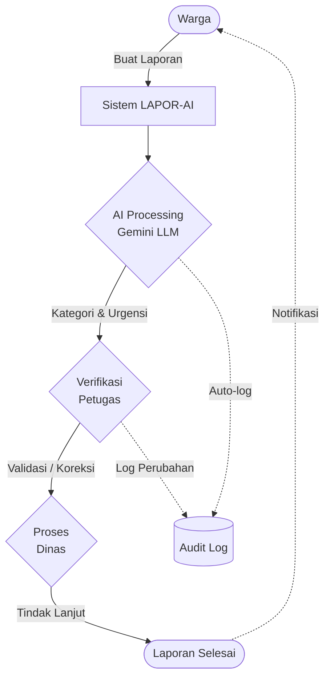
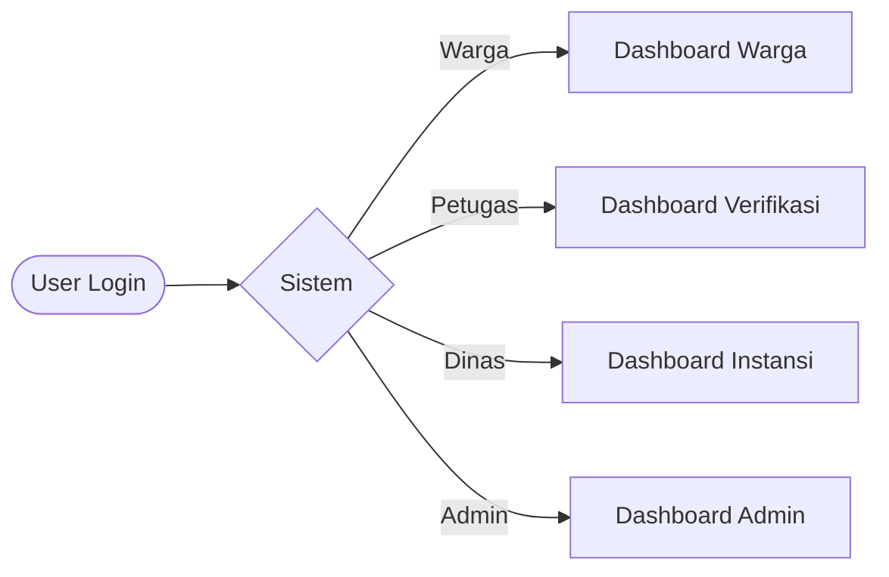

# LAPOR-AI Workflow Flowcharts

Berikut adalah ringkasan diagram alur (flowchart) dari sistem LAPOR-AI. Diagram ini menggunakan format **Mermaid** agar dapat dirender secara otomatis di GitHub.

## 1. Alur Laporan Utama & Transparansi Audit

## 2. Alur Akses Role (RBAC)

